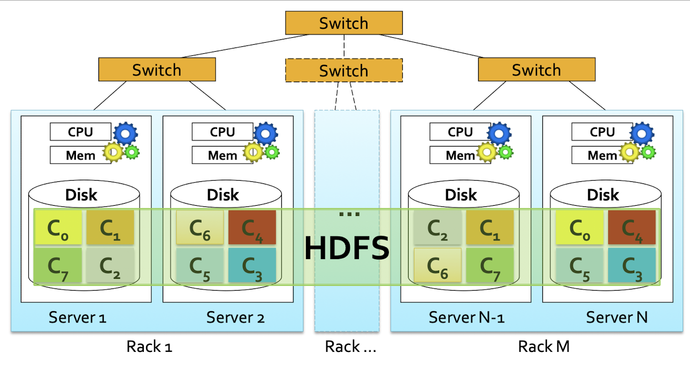

# MapReduce for Hadoop

Hadoop is a distributed Big Data Processing Infrastructure based on the MapReduce programming paradigm. It provides a high-level abstraction view, where programmers don’t need to care about task scheduling and synchronization, and is fault-tolerant, meaning that failures are automatically managed by the system.

HDFS (Hadoop Distributed File System) is an high avaiability distributed storage and is fault-tolerant. 

Each file is split in chunks that are spread across the servers. Each chunck is  replicated on different servers to manage failures and to always be able to parallelize the memory accesses. 



The Name Nodes in HDFS are special nodes/servers that store HDFS metadata and might be replicated. To access a file through HDFS APIs one should talk to the name node to find the chunk servers associated with the file of interest and then connect to it.

Hadoop programs are based on the MapReduce programming paradigm, which abstract the “distributed” part (scheduling, synchronization), which is handled by the framework.

Hadoop/MapReduce don’t fit well:

1. Iterative problems
2. Recursive problems
3. Stream data processing
4. Real-time processing

The MapReduce programming paradigm is based on the basic concepts of Functional programming. Everything is based on two “functions” with predefined signatures: Map and Reduce.

The Map function is applied over each element of an input data set and emits a set of (key, value) pairs

Ther Reduce function is applied over each set of (key, value) pairs with the same key and emits a new set of (key, value) pairs that represent the final result.


The map phase can be viewed as a transformation over each element of a set.
This transformation is a function m defined by developers and invoked one time for each input element in isolation.

The reduce phase can be viewed as an aggregate operation r defined by developers, invoked one time for each distinct key, that aggregates all the values associated with it. Each group of key-value pairs with the same key can be processed in isolation.

The shuffle and sort phase is always the same.

The design of MapReduce involves imposing the key-value structure on the input and output data sets. The key value is often ignored.

## Hadoop implementation of MapReduce

An Hadoop MapReduce program consists of three main parts:

1. Driver: Instance of the class that coordinates the configuration of the job and the “workflow” of the application.
2. Mapper: instance of the class that implements the map function.
The number of mappers is equal to the number of partitions of the input
3. Reducer: instance of the class that implements the reduce function. Processses (key, [list of values]) pairs and emits (key, value) pairs.
Is invoked one time for each distinct key
The number of reducers is set by the programmer, each reducer is associated with a set of keys.

Each part is implemented by means of a specific class


Hadoop has it’s own basic data types:

1. Text: like Java String
2. IntWritable: liike Java Integer
3. LongWritable: like Java Long
4. FloatWritable: like Java Float

The basic Hadoop data types implement the Writable and WritableComparable interfaces. All data types used to represent keys are instances of WritableComparable, since keys must be “comparable” to support the sort and shuffle phase.
All data types used to represent values are instances of Writable, they are usually also instances of WritableComparable, even though it is not indispensable.

Developers can define new data types by implementing the Writable and WritableComparable interfaces, which s useful to manage complex data types.

The input of the MapReduce program is an HDFS file. The classes extending the InputFormat abstract class are used to read the input data and “logically transform” the input HDFS file in a set of (key, value) pairs.

InputFormat “describes” the input-format specification for a MapReduce application and processes the input file. The InputFormat class is used to read the input data and validate its compliance with the input format expected, to split the input file into logical input splits and to provide the RecordReader implementation to be used to divide the logical input split in a set of (key, value) pairs for the mappers.


TextInputFormat is an InputFormat for plain text files, where files are broken into lines and a (key, value) pair is emitted for each line, where the key is the offset of the line, and the value is the content of the line.

KeyValueTextInputFormat is an InputFormat for plain text files, where each line must have the format key<separator>value (the default separator is \t). Files are broken into lines and a pair is emitted for each line, where the key is te text preceding the separator and the value is the text following.

The classes extending the OutputForm at abstract class are used to write the output of the MapReduce program in HDFS.
There are predefined class extending it, such as TextOutputFormat, SequenceFileOutputFormat, …
The TextOutputFormat is an OutputFormat for plain text files, where for each output (key, value) pair one line is written in the output file
The format of each output line is key\tvalue\n.

## Combiner

Combiners, aka mini-reducers, perform some pre-aggregations to limit the amount of network data and are instances of the Reducer class that must be specified in the Driver.

Combiners reduce the amount of data sent on the network.


The (key, value) pairs emitted by the Mappers are analyzed in the main-memory (or on the local disk) and aggregated by the Combiners. Each Combiner pre-aggregates the values associated with the pairs emitted by the Mappers of a cluster node. 

Combiners work only if the reduce function is commutative and associative. 
The execution of Combiners is not guaranteed ← The job must not rely on the Combiner execution.

## Personalized Data Types

Personalized data types are useful when the value of a key-value pair is a complex data type.

They are defined by the Writable interface and must implement the the following methods:

public void readFields(DataInput in)
public void write(DataOutput out)

```java
public class PMVal implements org.apache.hadoop.io.Writable{
	private float value;
	private int count;
	
	@Override
	public void readFields(DataInput in) throws IOException{
		value = in.readFloat();
		count = in.readInt();
	}
	@Override
	public void write(DataOutput out) throws IOException{
		out.writeFloat(value);
		out.writeInt(count);
	}
}
```

Personalized data types can also be used to manage complex keys, in which case they must be implemented by the WriteComparable interface since keys must be 
compared/sorted ← the method compareTo() must be implemented
split into groups ← the method hashCode() must be implemented

## Sharing Parameters

The configuration object is used to share the configuration of the Hadoop environment across driver, mappers and reducers of the job. 
It stores a list of (property-name, property-value) pairs.

Personalized pairs can be used to share some parameters of the application with mappers and reducers.

Personalized pairs are useful to share small constant properties that are avaible only during the execution of the program.
They are set in the Driver and can be accessed (not modified!) by Mappers and Reducers.

```java
// In the driver:
Configuration conf = this.getConf();
conf.set("property-name", "value");

// In the Mapper/Reducer 
// setup method - it's a constant so I retrive it once for each mapper
context.getConfiguration().get("property-name"); //returns a String
```

## Counters

Hadoop provides a set of basic, built-in, counters to store some statistics about jobs, mappers, reducers.

User-defined counters can be defined to compute global statistics

Counters are defined by means of Java enum and must be associated with integers values, they are incremented (not modified!) in the Mappers and Reducers, the global value of each counter is available at the end of the job and is store/printed by the driver 

```java
// In the Driver (outside run())
public static enum COUNTERS{
	COUNTER1,
	COUNTER2
}  // this defines two counters: COUNTERS.COUNTER1 and COUNTERS.COUNTER2

// In Mapper/Reducer
context.getCounter(COUNTERS.COUNTER1).increment(value); //value must be an int!

// In the Driver
// lets retrive the value of COUNTER1 
if (job.waitForCompletion(true) == true){
			exitCode = 0;
			Counter c = job.getCounters().findCounter(COUNTERS.COUNTER1);
			System.out.println("Total number of records = " + c.getValue());
}
```

User-defined counters can also be defined on the fly, but it is not recommended

```java
incrCounter("group-name", "counter-name", value); 
```

## Map-only job

In some applications all the work can be performed by the mapper(s).

Hadoop allows executing Map-only jobs where the reduce fase is avoided and the shuffle and sort phase is not executed

```java
job.setNumReduceTasks(0);
// don't define the reduce class nor it's characteristics
```

## In-Mapper combiner

Mapper classes are also characterized by a setup and a cleanup method

The setup method is called once for each mapper, prior to the many calls of the map method.
It can be used to set the values of in-mapper local variables, which are used to mantain in-mapper statistics and preserve the state within and across calls to the map method.
Each mapper has it’s own copy of the in-mapper variables.

```java
HashMap<String, Integer> wordsCounts;
protected void setup(Context context) {
		wordsCounts = new HashMap<String, Integer>();
	}
```

The cleanup method is called once for each mapper after the many calls to the map method.
It can be used to emit (key, value) pairs based on the value of the in-mapper variables/statistics.

```java
protected void map(){
	//...
	wordsCount.put(new String(cleanedWord), new Integer(1));
}

protected void cleanup(Context context) throws IOException, InterruptedException {
		// Emit the set of (key, value) pairs of this mapper
		for (Entry<String, Integer> pair : wordsCounts.entrySet()) {
			context.write(new Text(pair.getKey()),
					new IntWritable(pair.getValue()));
		}
	}
```

Also reducer classes are characterized by a setup and cleanup method.

In-Mapper combiners are a possible improvement over standard combiners.
Inizialize, in the setup method, a set of in-mapper variables during the instance of the mapper.
Update the in-mapper variables in the map-method
After all the input records of a mapper have been analyzed by the map method, emit the output (key, value) pairs of the mapper. The pairs are emitted in the cleanup method, based on the in-mapper variables.

The in-mapper variables are used to perform the work of the combiner in the mapper 
!Attention to the amount of used main memory!

## Filtering Patterns

### Top-k

The goal is to select a small set of top K records according to a ranking function to focus on the most important records of the input data set.

Each mapper initializes an in-mapper (local) top k list, the cleanup method emits the k (key, value) pairs associated with the in-mapper local top k records ← key is the “null key”, value is an in-mapper top k record.

A single reducer must be instantiated, since it is needed to have one single global view over the intermediate results emitted by the mapper to compute the final top k records.
It computes the final top k list by merging the local lists emitted by the mapper.
All input (key, value) pairs have the same key! (← hence the reduce method is only called once)

### Distinct

The goal is to find a unique set of values/records.

The mappers emit one (key, value) pair for each input record, where the key is the input record, and the value is null.

The reducers emit one (key, value) pair for each input (key, list of values) pair
(It is possible to use multiple instances of a reducer)

## Multiple inputs

In some applications data are read from two or more datasets, which could have different formats.

If the formats are different, one different mapper for each input dataset must be specified.
The key-value pairs emitted by the mappers ust be consistent in terms of data types

```java
//FileInputFormat.addInputPath(job, inputPath);
// Specify 2 input paths and the mappers associated to each of them
MultipleInputs.addInputPath(job, new Path(args[1]), 
														TextInputFormat.class, Mapper1.class);
MultipleInputs.addInputPath(job, new Path(args[2]), 
														TextInputFormat.class, Mapper2.class);
//job.setInputFormatClass(TextInputFormat.class);
//job.setMapperClass(MapperBigData.class);
```

## Multiple outputs

In some applications it could be useful to store the output key-vale pairs of a MapReduce application in different files, each one containing a specific subset of the emitted key-value pairs.
Each file name has a prefix used to specify the content of the file.
All the files are stored in one single output directory.

```java
MultipleOutputs.addNamedOutput(job, "prefix", TextOutputFormat.class,
														// key data type, value data type
															 Text.class, NullWritable.class);
```

```java
private MultipleOutputs<Text, NullWritable> mos = null;

// In the setup method:
mos = new MultipleOutputs<Text, NullWritable>(context);

// In the map() method:
mos.write("prefix", key, value);

// In the cleanup method
mos.close()
```

## Distributed cache

Some applications need to share and cache small read-only files.
These files should be accessible by all nodes of the cluster in an efficient way → a copy of the cached files should be available locally in al nodes.

Distributed cache is a facility provided to cache files.

During the initialization of the job, Hadoop creates a local copy of the cached files in all nodes that are used to execute a task of the job.

The cached file is usually read in the setup method.

The efficiency of the distributed cache depends on the number of multiple mappers(reducers) running on the same node/server.

Without the distributed cache, each task would have to read, in the setup method, the shared HDFS file. Reading data from HDFS is more inefficient → more time needed.

```java
public int run(String[] args) throws Exception{
	// if the file comes from the job1 path = outputDir + "/part-m-00000"
	job.addCacheFile(new Path("hdfspath/filename").toUri());
	...
}
```

```java
private ArrayList<String> stopWords;
protected void setup(Context context) throws IOException, InterruptedException{
	String line;
	// Retrive the original paths of the distributed files
	URI[] urisCachedFiles = context.getCacheFiles();
	// Read and process the content of the file - 1st file in this case
	BufferedReader file = new BufferedReader(new FileReader(
		new File(new Path(urisCachedFiles[0].getPath()).getName())));
	// Iterate over the lines of the file
	while((line = file.readLine())!=null){
		// process the line
		stopWords.add(line);
	}
	file.close();
}
```
